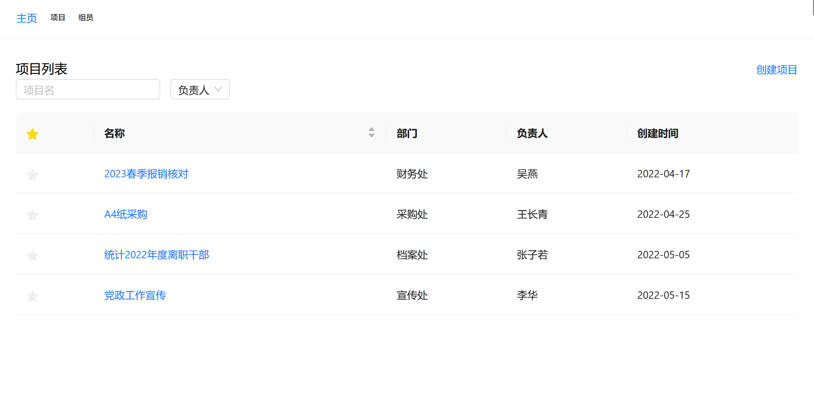

## 技术栈

TypeScript\React18\React-router\React-query\antD\css-in-js(styled)

## 项目描述

作为政府部门管理者，统一管理下设部门各任务的工作进度情况，通过用户登录注册区分政府的不同部分，实现了搜索项目，项目列表的展示，项目的 CRUD，项目详情展示，以及每个项目的看板及任务组管理

### 登录界面

### 主页

